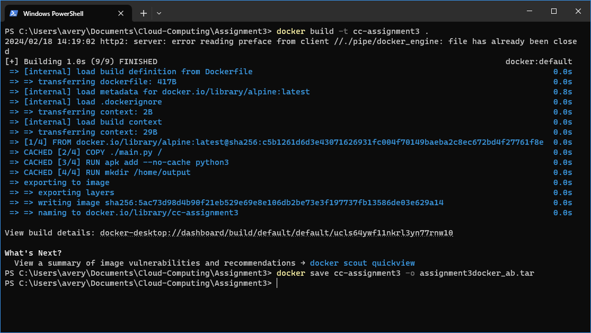
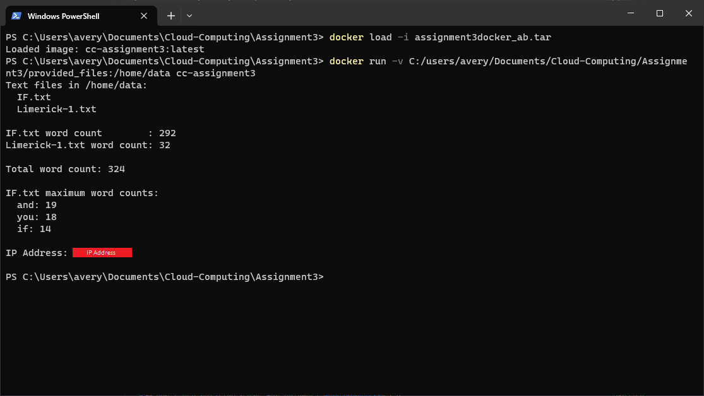

# Assignment 3

## Process

### Creating Image tar from Dockerfile

```shell
docker build -t cc-assignment3 .
docker save cc-assignment3 -o assignment3docker_ab.tar
```



### Running the Image from the tar

```shell
docker load -i assignment3docker_ab.tar
docker run -v {ABSOLUTE_PATH}/provided_files:/home/data cc-assignment3
```


